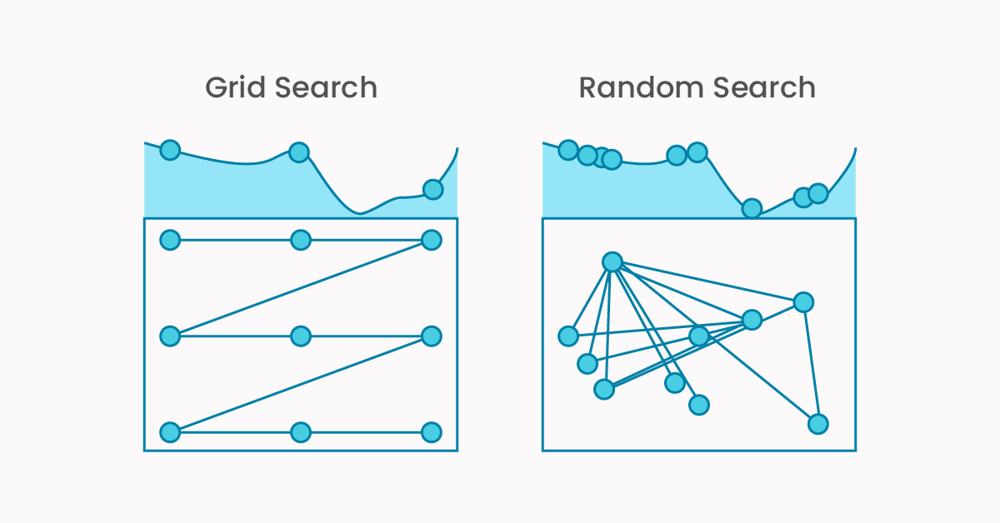

# Day 16 - HyperParameter Tuning and Cross Validation

## Cross Validation

Cross validation is a method of model validation in which the data is split into k subsets (folds), and the model is trained on k-1 subsets and validated on the remaining subset. This process is repeated k times, with each subset serving as the validation set once.

 [Reference](https://youtu.be/fSytzGwwBVw?si=IbnrTHHUsSJLGv-c)

 Types of Cross Validation:

 1. K-Fold Cross Validation
 2. Leave One Out Cross Validation
 3. Stratified K-Fold Cross Validation
 4. Time Series Cross Validation
 5. Group K-Fold Cross Validation

| CV Type           | Best For                    | Notes                        |
| ----------------- | --------------------------- | ---------------------------- |
| `KFold`           | Balanced, general purpose   | No class balance guarantee   |
| `StratifiedKFold` | Classification w/ imbalance | Maintains class distribution |
| `LeaveOneOut`     | Tiny datasets               | One test sample per fold     |
| `TimeSeriesSplit` | Time-based data             | Train before test only       |
| `GroupKFold`      | Grouped data                | Ensures groups stay intact   |

## What is Hyperparameter Tuning?

Hyperparameters are the settings of a model that you manually define before training.
Tuning is the process of finding the best combination to maximize model performance.

| Technique                             | Description                                              | Use Case                      |
| ------------------------------------- | -------------------------------------------------------- | ----------------------------- |
| **1. Manual Search**                  | Try a few combos by hand (trial & error)                 | Small models, quick tests     |
| **2. Grid Search**                    | Exhaustive search through all parameter combinations     | Small-to-medium grids         |
| **3. Randomized Search**              | Random combinations from defined distributions           | Large search spaces           |
| **4. Bayesian Optimization**          | Smart search based on previous results (probabilistic)   | Costly models, limited budget |
| **5. Genetic Algorithms**             | Uses evolution-inspired techniques to optimize           | Niche, advanced users         |
| **6. Hyperband / Successive Halving** | Prioritizes fast models first, eliminates bad ones early | Deep learning & big models    |

### Grid Search (GridSearchCV)

- Exhaustive
- Very slow for large spaces

### Randomized Search (RandomizedSearchCV)

- Faster than grid search
- Good for large search spaces

